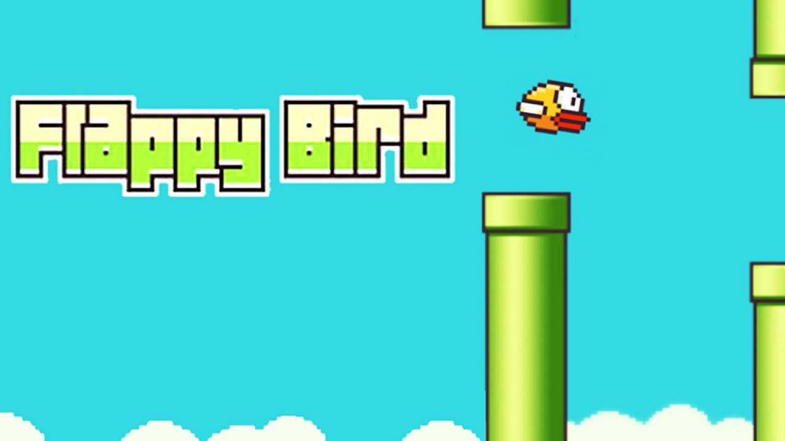

# Pequeno Projeto FlappyBird, feito em um curso da Cod3r

O projeto foi feito no curso da Cod3r, que é o "PHP 7 Completo - Curso do Desenvolvedor Web 2021 + Projetos". Tendo como objetivo Integra HTML, CSS e JavaScript, ele é desenvolvido na seção 24. Nessa e no projeto se visa aprender a manipular a DOM (Document Object Model). 
